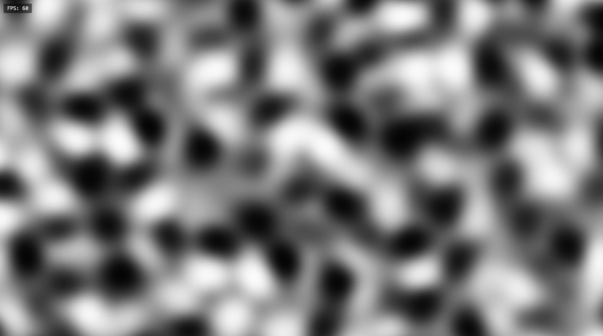

# 3D Simplex Noise Visualizer (WebGL)
*Vanilla WebGL & Pixi.js 実装*

🇯🇵 日本語 | [🇺🇸 English](README.md)

GPU加速による3D Simplex Noiseのリアルタイム可視化。用途に応じて選べる、ピュアWebGLまたはPixi.jsフィルターの実装を提供しています。



*60FPSで動作する滑らかな3D Simplex Noiseアニメーション*

## 🎯 どちらの実装を選ぶべきか？

| 用途 | Vanilla (samples/vanilla) | Pixi.js Filter (samples/pixi) |
|------|--------------------------|-------------------------------|
| **WebGLの学習** | ✅ 完全な低レベル制御 | ❌ 抽象化されている |
| **既存のPixi.jsプロジェクトへの追加** | ⚠️ 統合作業が必要 | ✅ 1行でフィルター追加 |
| **最高のパフォーマンス** | ✅ フレームワークオーバーヘッドなし | ⚠️ Pixi.js抽象化レイヤー |
| **最小バンドルサイズ** | ✅ 軽量 | ⚠️ Pixi.js依存関係が必要 |
| **カスタマイズの柔軟性** | ✅ 完全なシェーダー制御 | ✅ パラメータ設定可能 |

## 📁 プロジェクト構成

```
.
├── README.md              ← 現在のファイル
├── README.ja.md           ← 日本語版
├── screenshot.png
└── samples/               ← すべての実装はここにあります
    ├── vanilla/           ← ピュアWebGL実装
    │   ├── index.html
    │   ├── main.js
    │   ├── noise-renderer.js
    │   ├── gl-utils.js
    │   ├── shaders.js
    │   ├── style.css
    │   └── README.md      ← 詳細な使用方法
    └── pixi/              ← Pixi.jsフィルター実装
        ├── index.html
        ├── main.js
        ├── NoiseFilter.js ← 再利用可能フィルタークラス
        ├── noise-shaders.js
        ├── style.css
        └── README.md      ← 詳細なPixi.js使用ガイド
```

> **注意**: このリポジトリには複数のサンプル実装が含まれています。実際のソースコードは `samples/` ディレクトリに配置されています。

## 🚀 クイックスタート

### オプション1: Vanilla WebGL実装
WebGLの学習または最高のパフォーマンスが必要な場合

```bash
# クローンしてナビゲート
git clone [repository-url]
cd noise-webgl

# ブラウザで開く
open samples/vanilla/index.html
# またはローカルサーバーで配信
python -m http.server 8000
# http://localhost:8000/samples/vanilla にアクセス
```

### オプション2: Pixi.jsフィルター実装
既存のPixi.jsプロジェクトとの統合用

```bash
# デモを開く
open samples/pixi/index.html

# またはNoiseFilter.jsとnoise-shaders.jsをプロジェクトにコピー
cp samples/pixi/NoiseFilter.js your-project/
cp samples/pixi/noise-shaders.js your-project/
```

## 🎨 機能

### 共通機能（両実装）
- **GPU加速**: WebGL2による3D Simplex Noise
- **リアルタイムアニメーション**: 滑らかなZ軸アニメーション
- **高性能**: 4K解像度でも60 FPS
- **レスポンシブデザイン**: 自動ビューポート調整
- **FPSモニタリング**: 組み込みパフォーマンスカウンター

### Vanilla WebGL専用
- **教育的価値**: 完全なシェーダーパイプラインの可視化
- **依存関係ゼロ**: ピュアWebGL2実装
- **最適化されたレンダリング**: フルスクリーン三角形技法
- **分岐レスシェーダー**: 最大GPU効率

### Pixi.jsフィルター専用
- **簡単な統合**: 既存プロジェクトへのドロップインフィルター
- **モジュラー設計**: 再利用可能な`NoiseFilter`クラス
- **パラメータ制御**: ランタイムでのノイズプロパティ調整
- **フレームワーク利点**: Pixi.jsエコシステムとの互換性

## 🔧 技術詳細

### Simplex Noise実装
- Perlin Noiseアルゴリズムの改良版
- 3D座標空間（XY + 時間ベースZ）
- GLSLシェーダー実装（Ashima Arts）
- 最大パフォーマンスのためのGPU計算

### WebGL機能
- `#version 300 es`でのWebGL2コンテキスト
- `step`/`smoothstep`を使用した分岐レスシェーダー設計
- 効率的なフルスクリーンレンダリング技法
- 頂点バッファオーバーヘッドなし

## 📖 使用例

### Vanilla WebGL
```javascript
// シンプルな初期化
const canvas = document.getElementById('canvas');
const renderer = new NoiseRenderer(canvas);

// パラメータのカスタマイズ
renderer.noiseScale = 8.0;
renderer.animationSpeed = 0.5;
```

### Pixi.jsフィルター
```javascript
import { NoiseFilter } from './NoiseFilter.js';

// フィルター作成
const noiseFilter = new NoiseFilter({
    noiseScale: 5.0,
    animationSpeed: 0.2
});

// スプライトに適用
sprite.filters = [noiseFilter];

// アニメーション
app.ticker.add(() => noiseFilter.updateTime());
```

## 🎛️ カスタマイズ

両実装で以下のパラメータをサポート：

| パラメータ | デフォルト | 説明 |
|-----------|----------|------|
| `noiseScale` | 5.0 | パターン詳細度（高いほど細かい） |
| `animationSpeed` | 0.2 | アニメーション速度 |
| Resolution | ウィンドウサイズ | レンダリング寸法 |

## 🖥️ システム要件

- モダンブラウザ（Chrome、Firefox、Safari、Edge）
- WebGL2サポート
- ハードウェアアクセラレーション対応グラフィックス推奨

## 📊 パフォーマンス

- **デスクトップ**: 60 FPS（4Kまでテスト済み）
- **モバイル**: 30-60 FPS（デバイス依存）
- **メモリ**: 通常50MB未満の使用量

## 🤔 FAQ

**Q: ルートディレクトリにコードがないのはなぜ？**  
A: このリポジトリは複数の実装アプローチを紹介しています。完全な実装はそれぞれ`samples/`サブディレクトリに配置されています。

**Q: 両方の実装を一緒に使用できますか？**  
A: はい！同じGLSLシェーダーコードを共有しており、同じプロジェクト内で共存できます。

**Q: どちらの実装から始めるべきですか？**  
A: WebGLを学習する場合は`vanilla/`から。既存のPixi.jsプロジェクトがある場合は`pixi/`を使用してください。

## 📄 ライセンス

MITライセンス - 詳細は各実装ディレクトリを参照してください。

## 🔗 参考文献

- [Simplex Noise論文（Ken Perlin、2001）](https://weber.itn.liu.se/~stegu/simplexnoise/simplexnoise.pdf)
- [WebGL Noise by Ashima Arts](https://github.com/ashima/webgl-noise)
- [Pixi.jsドキュメント](https://pixijs.com/)